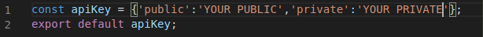
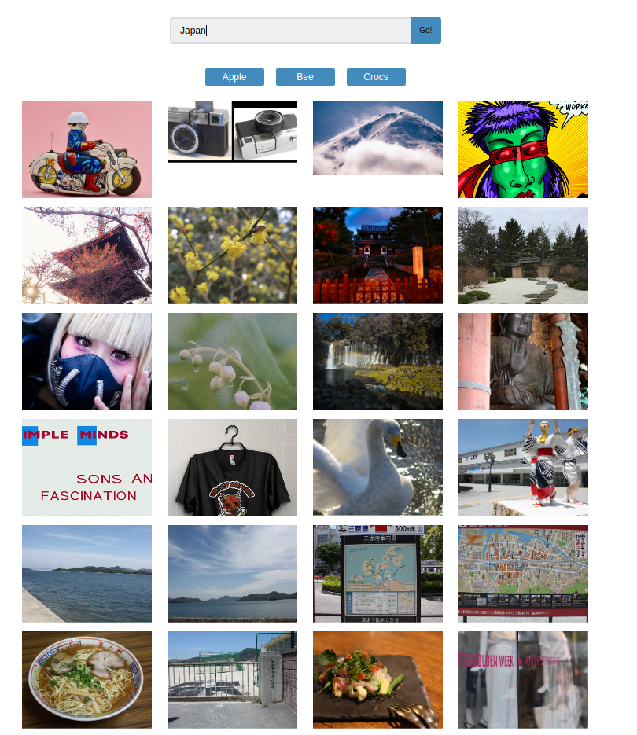

## Treehouse Project 07 - React Gallery

Uses React to fetch images from Flickr. 

### See live version
[Live version hosted on Heroku]()

### How to run locally
1. In the terminal type "npm install" and wait for it to install all the project dependencies.
2. If you do not have a Flickr API get then get one [here](https://www.flickr.com/services/api/misc.api_keys.html)
3. Create a file with the name of config.js in the src folder with the following contents, replace YOUR PUBLIC and YOUR PRIVATE with the keys you get from Flickr:

4. To start the app start "npm start", it will start a development server in your default browser.

